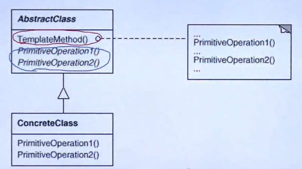
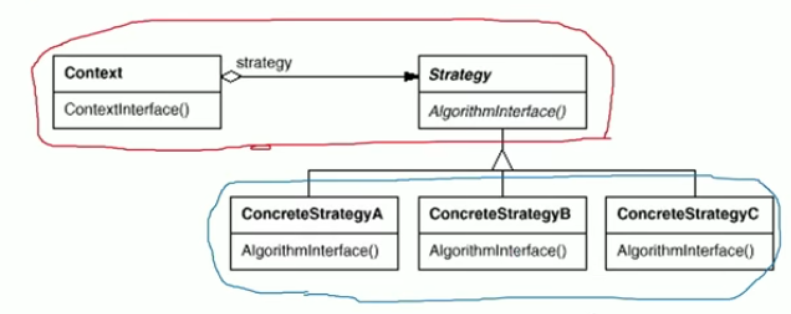

# Design Pattern
## [SOLID](https://www.dofactory.com/topic/1046/design-patterns-vs-design-principles-solid.aspx)
SOLID is an acronym for the first 5 principles of object-oriented design:

- SRP The Single Responsibility Principle: -- a class should have one, and only one, reason to change.
- OCP The Open Closed Principle: -- you should be able to extend a class's behavior, without modifying it.
- LSP The Liskov Substitution Principle: -- derived classes must be substitutable for their base classes.
- ISP The Interface Segregation Principle: -- make fine grained interfaces that are client specific.
- DIP The Dependency Inversion Principle -- depend on abstractions not on concrete implementations.

[SOLID（单一功能、开闭原则、里氏替换、接口隔离以及依赖反转）](https://zh.wikipedia.org/wiki/SOLID_(%E9%9D%A2%E5%90%91%E5%AF%B9%E8%B1%A1%E8%AE%BE%E8%AE%A1))

## Refactoring to Pattern 重构获得模式

1. 寻找变化点，在变化点处应用设计模式。
2. 设计模式不宜先入为主，一上来就使用。除非特别熟悉。提倡Refactoring to Pattern。

## 组件协作

组件协助模式通过晚期绑定，来实现框架与应用之间的松耦合。

1. [Template Method](#template-method)
2. [Strategy](#strategy)
3. [Observer](#observer)

## Template Method

1. 对于一项任务，常常有稳定的整体结构，但各个子步骤之间有许多改变的需求。

2. 如何在确定稳定操作结构的前提下,灵活地应对各个子步骤的变化或者晚期实现需求?

3. 定义：

   定义一个操作中的算法的骨架（**稳定**）,而将一些步骤延迟（**变化**）到子类中.Template Method使得子类刻意不改变（**复用**）一个算法的结构即可重定义（**override 重写**）该算法的某些特定步骤.(<<设计模式>> GoF) 

4. 早晚绑定

   library <---application  早绑定  application调用library

   library--->application 晚绑定   library调用application

5. 结构
    

  其中红色圈出的部分是稳定的，蓝色圈出的部分是变化的。

## Strategy

1. 动机

   在软件构建过程中，某些对象使用的算法可能多种多样，经常改变，如果这些算法都编码到对象中，将会使对象变得异常复杂。

2. 定义

   定义了一系列算法，把他们一个个封装起来，并且使他们可互相替换（**变化**）。该模式使得算法可独立于使用它的客户程序（**稳定**）而变化（**扩展，子类化**）。----《设计模式》 GOF

3. 结构

   

   其中红色圈出的部分是稳定的，蓝色圈出的部分是变化的。

4. 总结

   - strategy及其子类为组件提供了一系列可重用的算法，从而可以使得类型在**运行时**方便地根据需要在各个算法之间进行切换。
   - strategy模式提供了用条件判断语句以外的另一种选择，消除条件判断语句，就是在解耦合。含有许多条件判断语句的diamagnetic通常都需要strategy模式。

## Observer

1. 动机

   - 在软件构建过程中，我们需要为某些对象建立一种“通知依赖关系”---一个对象（目标对象）的状态发生改变，所有的依赖对象（观察者对象）都将得到通知。
   - 使用面向对象技术，可以将这种依赖关系弱化，并形成一种稳定的依赖关系，从而实现软件体系结构的松耦合。

   

## Creational Design Patterns

### Simple Factory

**When to Use?**

When creating an object is not just a few assignments and **involves some logic**, it makes sense to put it in a dedicated factory instead of repeating the same code everywhere.

1. 除了new 之外还有初始化上下文操作之类。
2. 多个子类时，可以根据名字（string）或者枚举变量（enum）来创建。 

