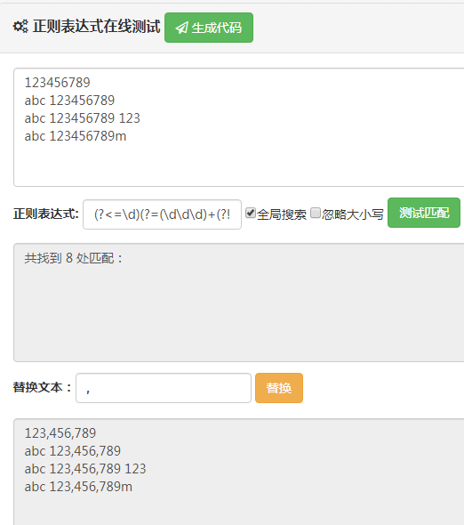
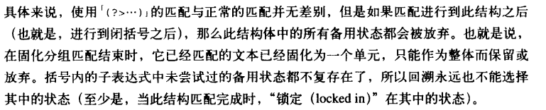
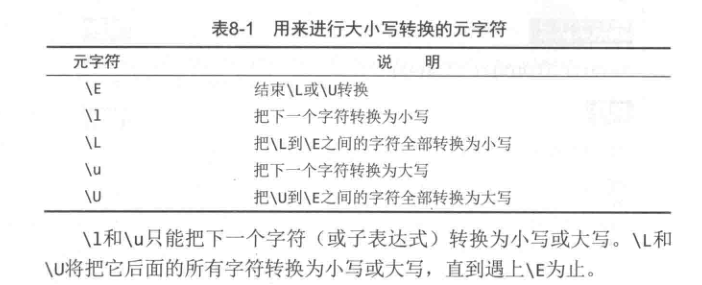
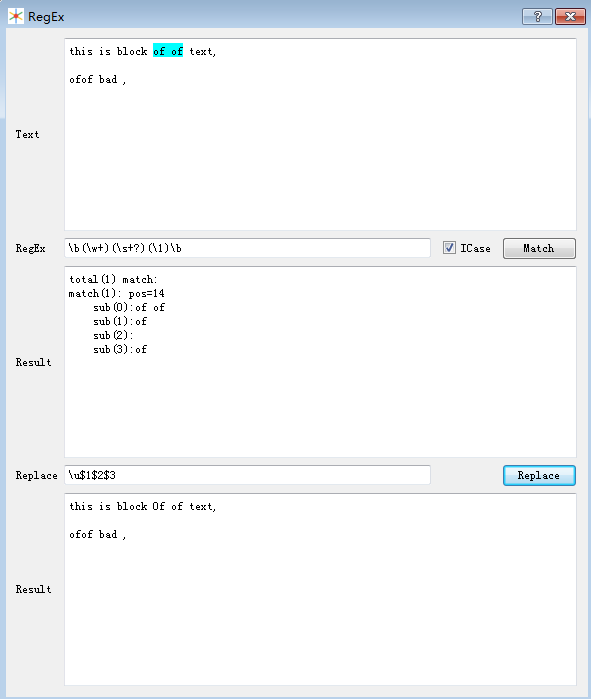
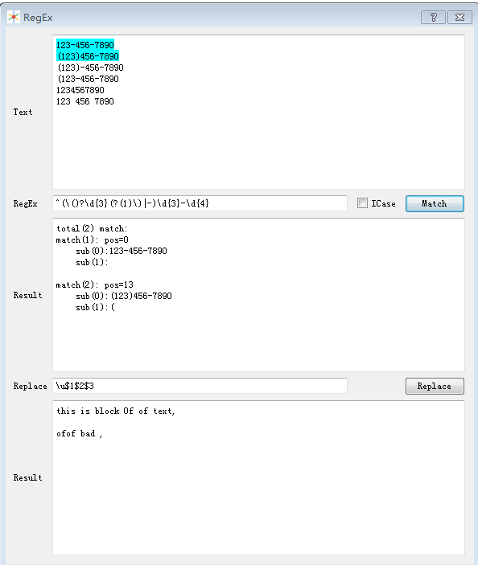

# Regex

### 工具

* 在线工具：

https://c.runoob.com/front-end/854

* 单机版小工具

为了巩固所学，自己使用c++开发了一个正则表达式工具：

发行版：[RegEx.exe](https://github.com/lilucpp/RegEx/releases)

源码：[lilucpp/RegEx](https://github.com/lilucpp/RegEx)

* 学习资料

入门：正则表达式必知必会+[修订版].pdf

进一步了解原理：精通正则表达式 [第三版].pdf

一个正则表达式简易教程[backup_addr](https://1drv.ms/b/s!AiOHW4QDJaFOhHVmUTC0i1pqY5CL?e=wKbh2z)：https://deerchao.cn/tutorials/regex/regex.htm


**以下是我易忘记的知识点：**

### 环视（也叫前后查找）

**要点：只匹配位置，不占字符。**

| 类型                                            | 正则表达式  | 匹配成功条件             |
| :---------------------------------------------- | :---------- | :----------------------- |
| 肯定顺序环视(positive lookahead)(正向前查找)    | (?=.......) | 子表达式能够匹配右侧文本 |
| 否定顺序环视(negative lookahead)(负向前查找)    | (?!......)  | 子表达式不能匹配右侧文本 |
| 肯定逆序环视(positive lookbehind)(正向后查找)   | (?<=......) | 子表达式能够匹配左侧文本 |
| 否定逆序环视(nagative lookbehind)（负向后查找） | (?<!......) | 子表达式不能匹配左侧文本 |

e.g. 为数字加千位分字符

```tex
123456789
abc 123456789 
abc 123456789 123
abc 123456789m
```

(?<=\d)(?=(\d\d\d)+(?!\d))

截图：



### 忽略优先

text: <x><x>123</x> and <x>456</x> of sums</x>

regex:  <x>.*?</x> 

​			<x>((?!<x>).)*?</x>

### 固化分组或占有优先量词

匹配小数点后3位，如果最后一位是0，匹配两位，然后替换

e.g., 

23.4453224 ->23.445

23.00132 -> 23.001 

23.000012 -> 23.00

23.235 -> 23.235 (效率考虑不做替换)

```
regex: \d\.(\d\d[1-9]?)\d* #23.235不符合
\d\.(\d\d(?>[1-9]?))\d+    #固化分组
\d\.(\d\d[1-9]?+)\d+       #占有优先量词，不做回溯。 23.235不符合，不做替换，符合要求
```

#### 用(?>...)实现固化分组 (Atomic Group )



[精通正则表达式 第三版] p.170


#### 占有优先量词， ？+、*+、++和{m, n}+

(possessive quantifiers)

从不交还已经匹配的字符。

### 回溯引用

#### 回溯引用匹配

this is block of of text,	 // match this

ofof bad ,

\s+?(\w+)\s+?\1\b

#### 大小写转换





### 嵌入条件

语法：(?(backreference)true-regex|false-regex)



前后查找条件：

\d{5}(?(?=-)-\d{4}))
  
### 一个环视的应用
```txt
匹配包含中文的字段：
name":\s*"(?![^"\u4e00-\u9fa5]+?").*?"

(?![^"\u4e00-\u9fa5]+?")： 不匹配包含 "、中文的的字符
\u4e00-\u9fa5：不包括中文符号《》（）等
```
