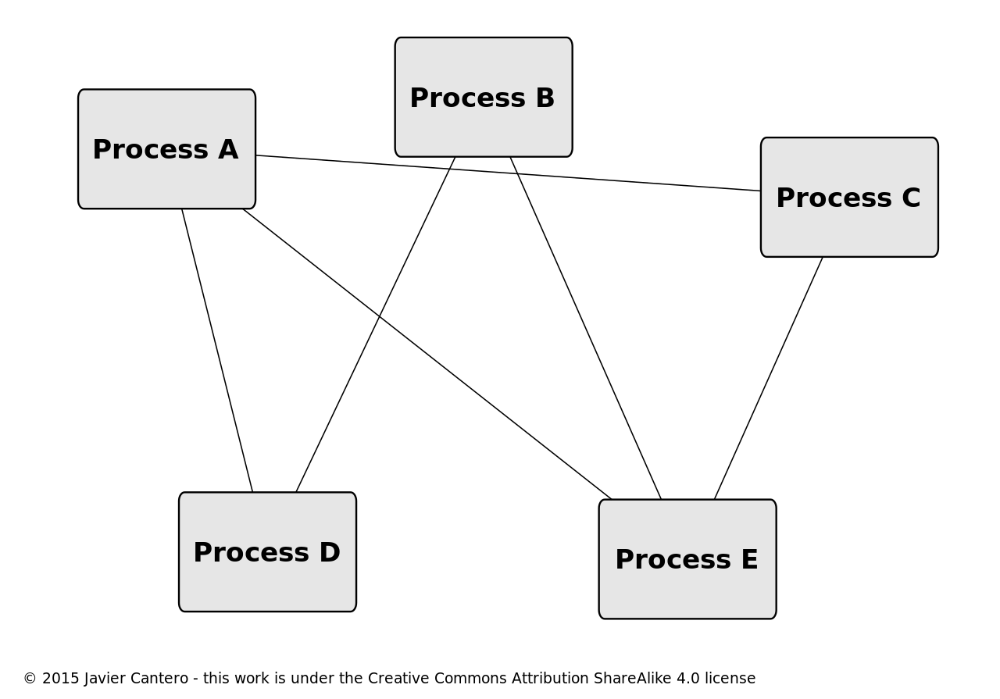

# dbus

## 简介

**D-Bus**是一个[进程间通信](https://zh.wikipedia.org/wiki/行程間通訊)及[远程过程调用](https://zh.wikipedia.org/wiki/远程过程调用)机制，可以让多个不同的[计算机程序](https://zh.wikipedia.org/wiki/计算机程序)（即[进程](https://zh.wikipedia.org/wiki/行程)）在同一台电脑上同时进行通信[[6\]](https://zh.wikipedia.org/wiki/D-Bus#cite_note-dbusovw-6)。D-Bus作为[freedesktop.org](https://zh.wikipedia.org/wiki/Freedesktop.org)项目的一部分，其设计目的是使[Linux](https://zh.wikipedia.org/wiki/Linux)[桌面环境](https://zh.wikipedia.org/wiki/桌面环境)（如[GNOME](https://zh.wikipedia.org/wiki/GNOME)与[KDE](https://zh.wikipedia.org/wiki/KDE)等）提供的服务标准化。

freedesktop.org项目同时也开发了一个称为libdbus的[自由及开放源代码软件](https://zh.wikipedia.org/wiki/自由及开放源代码软件)[函式库](https://zh.wikipedia.org/wiki/函式庫)，作为规范的参考实现。这个函式库常与D-Bus本身混淆。也存在着其他的D-Bus实现，像是GDBus (GNOME)[[7\]](https://zh.wikipedia.org/wiki/D-Bus#cite_note-gdbus-7)，QtDBus ([Qt](https://zh.wikipedia.org/wiki/Qt)/KDE)[[8\]](https://zh.wikipedia.org/wiki/D-Bus#cite_note-qtdbus-8)，dbus-java[[9\]](https://zh.wikipedia.org/wiki/D-Bus#cite_note-9)以及sd-bus（[systemd](https://zh.wikipedia.org/wiki/Systemd)的一部分）[[10\]](https://zh.wikipedia.org/wiki/D-Bus#cite_note-sd-bus-10)。

D-Bus可用于同一个桌面会话中不同[桌面](https://zh.wikipedia.org/wiki/桌面环境)[应用软件](https://zh.wikipedia.org/wiki/应用软件)间的通信，能集成桌面会话，也解决了进程的生命周期的问题。它也允许桌面会话与[操作系统](https://zh.wikipedia.org/wiki/操作系统)间的通信，这通常包括了[内核](https://zh.wikipedia.org/wiki/内核)与任何的系统[守护进程](https://zh.wikipedia.org/wiki/守护进程)或一般[进程](https://zh.wikipedia.org/wiki/行程)间的通信。



没有D-Bus时程序间的通信

[

使用D-Bus时程序间的通信

没有D-Bus时，如果大量的程序需要彼此进行通信，其通信网络将会非常复杂及庞大(因为大部分程序使用一对一通信)。使用D-Bus则可以简化通信网络。


简明解释：

D-Bus 是一种进程间通信 (IPC) 和远程过程调用 (RPC) 机制，最初是为 Linux 开发的，旨在用一个统一的协议取代现有的和竞争的 IPC 解决方案。它还被设计为允许系统级进程（例如打印机和硬件驱动程序服务）和普通用户进程之间的通信。


参考：

[1.[wiki-D-Bus]](https://zh.wikipedia.org/wiki/D-Bus)

### 库的选择

有多种可用的 D-Bus 绑定。正如 Ignacio 所说，您可以使用其中任何一个，因为它们都使用相同的协议 - 但某些绑定比其他绑定更适合某些情况。

推荐的高级绑定：

- [GDBus](https://developer.gnome.org/gio/stable/gdbus-convenience.html)是基于 GLib/GObject 的高级绑定。如果您正在编写基于 GNOME 技术或 GLib 的服务或应用程序，那么使用它是合适的。它是用 C 编写的，但使用 gobject-introspection 可以为其他语言提供绑定（在不同的功能级别）。
- [QtDBus](http://doc.qt.io/qt-5/qtdbus-index.html)是基于 Qt 的高级绑定。如果您正在编写基于 Qt 的服务或应用程序，那么使用它是合适的。它是用 C++ 编写的。

​	**调试**

在开发使用 D-Bus 的应用程序时，有时能够查看有关每个应用程序通过总线发送和接收的消息的信息会很有用。

通过在运行每个应用程序之前设置环境变量，可以在每个应用程序的基础上启用此功能`QDBUS_DEBUG`。例如，我们可以仅对汽车中的汽车启用调试[D-Bus Remote Controlled Car Example](https://doc.qt.io/qt-5/qtdbus-remotecontrolledcar-example.html)通过以下方式运行控制器和汽车：

```
examples/dbus/remotecontrolledcar/controller/controller &
QDBUS_DEBUG=1 examples/dbus/remotecontrolledcar/car/car &
```

有关消息的信息将写入启动应用程序的控制台。

**推荐的低级绑定：**

- [sd-bus](https://www.freedesktop.org/software/systemd/man/sd-bus.html)是一个较低级别的绑定，具有很少的依赖性。如果您正在编写系统服务或系统应用程序并且不使用 GLib 或 Qt，那么它是合适的。它是用C写的。

***不*推荐的绑定：**

- [libdbus](https://dbus.freedesktop.org/doc/api/html/)是官方 D-Bus 实现附带的较低级别的绑定。它很旧，而且自编写以来，设计 D-Bus API 的最佳实践已经得到了改进。建议您不要*使用*libdbus。正如文档中所说：“如果您直接使用这个低级 API，您将承受一些痛苦。”。使用起来很不方便。它是用C写的。
- [dbus-glib](https://dbus.freedesktop.org/doc/dbus-glib/)是一个高级绑定，附属于官方 D-Bus 实现。与 libdbus 一样，它很旧，并且最佳实践从那时起就一直在变化。建议您不要*使用*dbus-glib，而使用 GDBus。使用起来很不方便。它是用C写的。

## 概念

无论您使用什么应用程序框架来编写 D-Bus 应用程序，一些基本概念都适用。然而，对于 GLib、Qt 和 Python 应用程序，您编写的确切代码会有所不同。

这是一个图表，可以帮助您直观地了解接下来的概念。 

### Native Objects and Object Paths(本机对象和对象路径)

您的编程框架可能定义了“对象”是什么样的；通常有一个基类。例如：java.lang.Object、GObject、QObject、python 的基本对象或其他任何东西，我们将其称为本*机对象*。

低级 D-Bus 协议和相应的 libdbus API 不关心本机对象。然而，它提供了一个称为 *对象路径*的概念。对象路径的想法是，更高级别的绑定可以命名本机对象实例，并允许远程应用程序引用它们。

对象路径看起来像文件系统路径，例如对象可以命名为`/org/kde/kspread/sheets/3/cells/4/5`。人类可读的路径很好。

命名空间对象路径是智能的，通过使用您拥有的域名的组件（例如`/org/kde`）来启动它们。这可以防止同一进程中的不同代码模块互相干扰。

### Methods and Signals（方法和信号）

每个对象都有*成员*，两种成员是*方法*和 *信号*。方法是可以在对象上调用的操作，具有可选的输入和输出。信号从对象广播到对象的任何感兴趣的观察者；信号可以包含数据有效负载。

方法和信号都通过名称来引用，例如“Frobate”或“OnClicked”。

### Interfaces（接口）

每个对象都支持一个或多个*接口*。将接口视为一组命名的方法和信号。

### Proxies（代理）

代理*对象*是一种方便的本机对象，创建它来表示另一个进程中的远程对象。低级 DBus API 涉及手动创建方法调用消息、发送该消息，然后手动接收和处理方法回复消息。更高级别的绑定提供代理作为替代方案。代理看起来就像一个普通的本机对象；但是当您调用代理对象上的方法时，绑定会将其转换为 DBus 方法调用消息，等待回复消息，解压返回值，然后从本机方法返回它。

In pseudocode, programming without proxies might look like this:

```c
          Message message = new Message("/remote/object/path", "MethodName", arg1, arg2);
          Connection connection = getBusConnection();
          connection.send(message);
          Message reply = connection.waitForReply(message);
          if (reply.isError()) {
             
          } else {
             Object returnValue = reply.getReturnValue();
          }
        
```


Programming with proxies might look like this:

```c
          Proxy proxy = new Proxy(getBusConnection(), "/remote/object/path");
          Object returnValue = proxy.MethodName(arg1, arg2);
```

### Bus Names

当每个应用程序连接到总线守护程序时，守护程序立即为其分配一个名称，称为*唯一连接名称*。唯一名称以“:”（冒号）字符开头。这些名称在总线守护程序的生命周期内永远不会重复使用 - 也就是说，您知道给定的名称将始终引用相同的应用程序。唯一名称的一个示例可能是 `:34-907`。冒号后面的数字除了唯一性之外没有任何意义。

应用程序可能会要求拥有其他*知名名称*。例如，您可以编写规范来定义名为 的名称`com.mycompany.TextEditor`。

您可以将唯一名称视为 IP 地址，将众所周知的名称视为域名。因此 `com.mycompany.TextEditor`可能会映射到类似的东西， `:34-907`就像`mycompany.com`映射到类似的东西一样`192.168.0.5`。

除了路由消息之外，名称还有第二个重要用途。它们用于跟踪生命周期。当应用程序退出（或崩溃）时，其与消息总线的连接将被操作系统内核关闭。然后，消息总线发出通知消息，告诉剩余的应用程序该应用程序的名称已失去其所有者。通过跟踪这些通知，您的应用程序可以可靠地监视其他应用程序的生命周期。

总线名称还可用于协调单实例应用程序。

### Addresses（地址）

使用 D-Bus 的应用程序要么是服务器，要么是客户端。服务器监听传入的连接；客户端连接到服务器。连接一旦建立，就是一个对称的消息流；客户端与服务器的区别仅在建立连接时才重要。

如果您正在使用总线守护程序（您可能就是这样），您的应用程序将成为总线守护程序的客户端。也就是说，总线守护程序侦听连接，并且您的应用程序启动与总线守护程序的连接。

D-Bus*地址*指定服务器将侦听的位置以及客户端将连接的位置。例如，该地址 `unix:path=/tmp/abcdef`指定服务器将侦听该路径上的 UNIX 域套接字 `/tmp/abcdef`，并且客户端将连接到该套接字。地址还可以指定 TCP/IP 套接字，或 D-Bus 规范的未来迭代中定义的任何其他传输。

### Big Conceptual Picture（大概念图）

将所有这些概念放在一起，为了指定对特定对象实例的特定方法调用，必须命名许多嵌套组件：

```
 Address -> [Bus Name] -> Path -> Interface -> Method
```

总线名称位于括号中，表明它是可选的 - 您只需提供一个名称，以便在使用总线守护程序时将方法调用路由到正确的应用程序。如果您直接连接到另一个应用程序，则不会使用总线名称；没有总线守护进程。

为了便于记住命名格式及其用途，可以使用下表：

|      D总线概念       |     比喻     |            姓名格式            |
| :------------------: | :----------: | :----------------------------: |
| 服务名称（bus name） |  网络主机名  |   点分隔（“看起来像主机名”）   |
|       对象路径       | URL 路径组件 | 斜杠分隔（“看起来像一条路径”） |
|         接口         |  插件标识符  |             点分隔             |

### Messages - Behind the Scenes（消息 - 幕后花絮）

D-Bus 通过在进程之间发送消息来工作。如果您使用足够高级的绑定，您可能永远不会直接使用消息。

有 4 种消息类型：

- 方法调用消息要求调用对象上的方法。
- 方法返回消息返回调用方法的结果。
- 错误消息返回由调用方法引起的异常。
- 信号消息是已发出给定信号（已发生事件）的通知。您也可以将这些视为“事件”消息。


方法调用非常简单地映射到消息：您发送方法调用消息，并在回复中接收方法返回消息或错误消息。

每条消息都有一个*标头*（包括*字段*）和一个*正文*（包括*参数）*。您可以将标头视为消息的路由信息，将正文视为有效负载。标头字段可能包括发送方总线名称、目标总线名称、方法或信号名称等。标头字段之一是描述主体中找到的值的*类型签名。*例如，字母“i”表示“32位整数”，因此签名“ii”表示有效负载有两个32位整数。

### Calling a Method - Behind the Scenes（调用方法 - 幕后花絮）

DBus 中的方法调用由两条消息组成；从进程 A 发送到进程 B 的方法调用消息，以及从进程 B 发送到进程 A 的匹配方法回复消息。调用和回复消息都通过总线守护程序进行路由。呼叫者在每条呼叫消息中包含不同的序列号，并且回复消息包含该号码以允许呼叫者将回复与呼叫匹配。

调用消息将包含该方法的所有参数。回复消息可能指示错误，或者可能包含该方法返回的数据。


总线守护进程从不重新排序消息。也就是说，如果您向同一收件人发送两个方法调用消息，则将按照发送顺序接收它们。然而，接收者不需要按顺序回复呼叫；例如，它可以在单独的线程中处理每个方法调用，并根据线程完成的时间以未定义的顺序返回回复消息。方法调用具有唯一的序列号，方法调用者使用该序列号来将回复消息与调用消息相匹配。

### Emitting a Signal - Behind the Scenes（发出信号 - 幕后）

DBus 中的信号由一条消息组成，由一个进程发送到任意数量的其他进程。也就是说，信号是单向广播。该信号可能包含参数（数据有效负载），但由于它是广播，因此它永远不会有“返回值”。将此与方法调用进行对比（请参阅[“调用方法 - 幕后”部分](https://dbus.freedesktop.org/doc/dbus-tutorial.html#callprocedure)），其中方法调用消息具有匹配的方法回复消息。

信号的发射器（也称为发送器）不知道信号接收器。接收者向总线守护程序注册，以根据“匹配规则”接收信号 - 这些规则通常包括发送者和信号名称。总线守护进程仅将每个信号发送给对该信号表示感兴趣的接收者。

### Introspection（内省）

D-Bus 对象可能支持该接口`org.freedesktop.DBus.Introspectable`。该接口有一个`Introspect`不带参数并返回 XML 字符串的方法。XML 字符串描述了对象的接口、方法和信号。有关此内省格式的更多详细信息，请参阅 D-Bus 规范。


参考：

[1. [dbus-tutorial]](https://dbus.freedesktop.org/doc/dbus-tutorial.html)