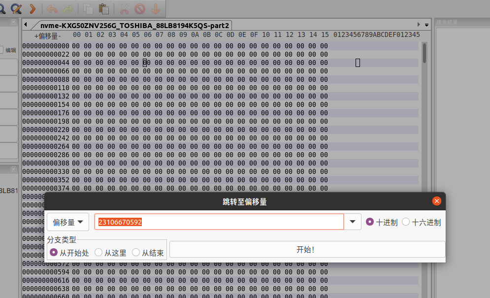
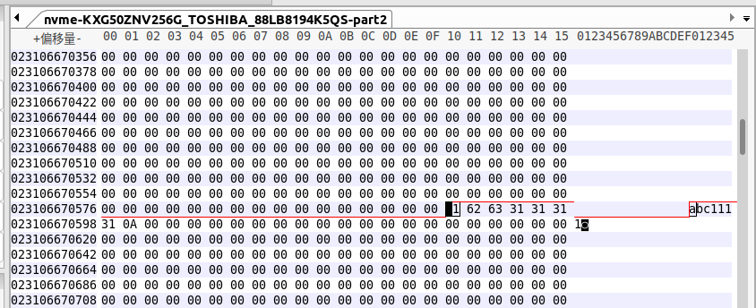

1、查看文件中在物理磁盘的偏移

```shell
lu$ cat 1.txt 
abc1111
lu$ 
lu$ filefrag -e ./1.txt 
Filesystem type is: ef53
File size of ./1.txt is 8 (1 block of 4096 bytes)
 ext:     logical_offset:        physical_offset: length:   expected: flags:
   0:        0..       0:    5641277..   5641277:      1:             last,eof
./1.txt: 1 extent found
lu$ 

```

2、查看文件系统在磁盘的位置。

```shell
lu$ sudo fdisk -l
Disk /dev/nvme0n1：238.47 GiB，256060514304 字节，500118192 个扇区
Disk model: KXG50ZNV256G TOSHIBA                    
单元：扇区 / 1 * 512 = 512 字节
扇区大小(逻辑/物理)：512 字节 / 512 字节
I/O 大小(最小/最佳)：512 字节 / 512 字节
磁盘标签类型：gpt
磁盘标识符：066C336C-AC23-45A7-B422-DAAC8EA0A8CB

设备              起点      末尾      扇区  大小 类型
/dev/nvme0n1p1    2048   1050623   1048576  512M EFI 系统
/dev/nvme0n1p2 1050624 500117503 499066880  238G Linux 文件系统
lu$ 

```

3、使用wxHexEditor打开/dev/nvme0n1p2   

- 设备--打开设备  



- CTRL+G 跳转

  5641277*4096=23106670592



跳转后即可看到1.txt的内容。
