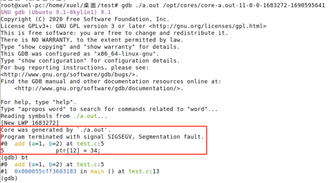
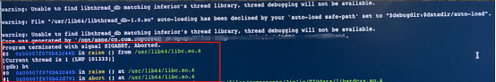
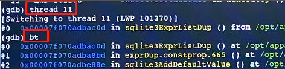
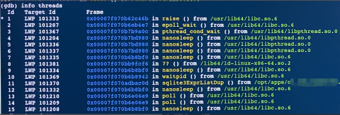

#  利用core文件和gdb调试崩溃

##  开启转存

### 永久开启core文件无限制：

​	vi /etc/security/limits.conf  

​	打开* soft core unlimited  

​	加一行root soft core unlimited（使root用户生效）  

​	重启机器  

### 永久修改core文件保存位置（以/opt/cores举例）：

​	vi /etc/sysctl.conf  

​	打开并修改格式kernel.core_pattern=/opt/cores/core-%e-%s-%u-%g-%p-%t  

​	执行sysctl -p使生效  

​	mkdir /opt/cores  

​	chmod 777 /opt/cores（使普通用户有写权限）  

### 查看是否生效：

​	ulimit -c（unlimited即为生效）  

​	切换普通用户和root用户分别查看下  

## 示例

新建文件test.c，内容如下：

```c++
int add(int a, int b)
{ 
        int c = a + b;
        char* ptr=0;
        ptr[12] = 34;
        return c;
}
int main()
{
        int a = 1;
        int b = 2;
        add(a, b);
        return 0;
}
```

编译：gcc test.c -g（加-g参数调试时能看到源文件多少行）  

执行：./a.out发现崩溃  

这时/opt/cores里已经记录了core-a.out-11-0-0-1683272-1690595641  

调试：gdb ./a.out /opt/cores/core-a.out-11-0-0-1683272-1690595641   

   

可以看到test.c源文件第5行ptr[12]=34;这一语句崩溃了。  

输入bt可以看到调用堆栈，输入q退出。  

## 多线程调试

用gdb加载上可执行程序和core文件后，输入bt查看导致崩溃的线程堆栈。

  

输入info threads可以看到所有线程 

  

输入thread 线程id可切换线程，再输bt查看该线程堆栈

  