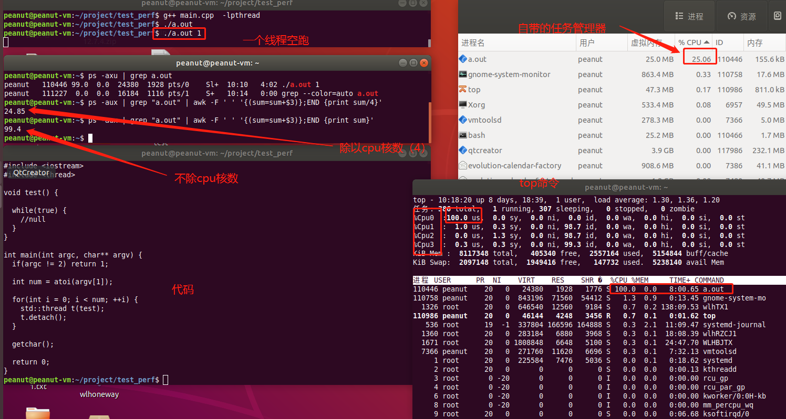
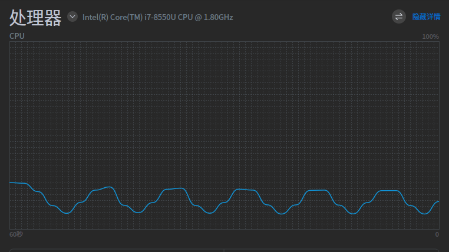

# 真实cpu利率的ps

ps中实际上统计的是单个cpu的累加值。如果测试电脑是4线程，开启一个线程空跑，理论的cpu利用率是25%。而ps axu出来的是100%，原因是没有除以cpu核数。因此需要一个计算真实cpu利用率的ps。



## 准备代码

### 拉取代码

```shell
git clone https://gitlab.com/procps-ng/procps.git
code ./procps
```

### 修改代码

```diff
## 修改
peanut@peanut-vm:~/project/procps/src/ps$ git diff -U10 ./output.c
diff --git a/src/ps/output.c b/src/ps/output.c
index 7b9ecd16..8d833dd2 100644
--- a/src/ps/output.c
+++ b/src/ps/output.c
@@ -539,20 +539,27 @@ setREL4(TICS_ALL,TICS_ALL_C,TIME_ELAPSED,UTILIZATION)
 static int pr_pcpu(char *restrict const outbuf, const proc_t *restrict const pp){
   unsigned long long total_time;   /* jiffies used by this process */
   unsigned pcpu;                   /* scaled %cpu, 999 means 99.9% */
   unsigned long long jiffies;      /* jiffies of process life */
 setREL4(TICS_ALL,TICS_ALL_C,TIME_ELAPSED,UTILIZATION)
   pcpu = 0;
   if(include_dead_children) total_time = rSv(TICS_ALL_C, ull_int, pp);
   else total_time = rSv(TICS_ALL, ull_int, pp);
   jiffies = rSv(TIME_ELAPSED, real, pp) * Hertz;
   if(jiffies) pcpu = (total_time * 1000ULL) / jiffies;
+
+  int th_num = sysconf( _SC_NPROCESSORS_CONF);
+  pcpu = ceil(pcpu*1.0/th_num);
+
+  //if(pcpu > 50)
+  //  pcpu = 50;
+
   if (pcpu > 999U)
     return snprintf(outbuf, COLWID, "%u", pcpu/10U);
   return snprintf(outbuf, COLWID, "%u.%u", pcpu/10U, pcpu%10U);
 }
 
 /* this is a "per-mill" format, like %cpu with no decimal point */
 static int pr_cp(char *restrict const outbuf, const proc_t *restrict const pp){
   unsigned long long total_time;   /* jiffies used by this process */
   unsigned pcpu;                   /* scaled %cpu, 999 means 99.9% */
   unsigned long long jiffies;      /* jiffies of process life */
```

## 编译

```shell
cd procps
./autogen.sh
mkdir install
./configure  --prefix=/home/peanut/project/procps/install --without-ncurses
make 
make install

```

## 打包

```shell
cd install/bin
patchelf --set-rpath "\$ORIGIN" ./ps
cp ../lib/libproc2.so.0  ./libproc2.so.0 
zip myps.zip ./libproc2.so.0  ./ps
```

## 其他

### 替换系统ps
如果`/bin/ps`下ps无法修改，可以使用`alias`来修改。

```shell
alias ps='/home/peanut/桌面/ps/ps'
```
### ps cpu vs top cpu
- ps cpu  
  进程的cpu利用率，格式为“##.#”。 目前，它是使用的CPU时间除以进程已运行的时间（cputime/realtime 比率），以百分比表示。(man ps)  
- top cpu  
  自上次屏幕更新以来任务所用 CPU 时间的份额，以总 CPU 时间的百分比表示。(man top)

ps 查询出来的cpu并不是实时cpu，也是cpu利用率的平均值。  

example code：cpu利用率正弦曲线
```c++
#include <chrono>
#include <cmath>
#include <cstdlib>
#include <iostream>
#include <thread>
#include <vector>

namespace sc = std::chrono;

const double PI = 3.141592653;
const long long US = 1000000;

int main(int argc, char** argv) {
  if (argc != 3) {
    std::cout << "usage: a.out time_cycle collect_points\n";
    std::cout << "\texample: 10s a cycle, 100 collection points.\n";
    std::cout << "\ta.out 10 100\n";

    return 1;
  }

  long long time_cycle = atoll(argv[1]) * US;
  int collect_points = atoi(argv[2]);
  long long time_interval = time_cycle / collect_points;

  std::cout << "time_interval=" << time_interval << "\n";

  std::vector<long long> busy_time(collect_points);
  std::vector<long long> idle_time(collect_points);

  double radian = 2 * PI / collect_points;
  for (int i = 0; i < collect_points; ++i) {
    busy_time[i] = time_interval * 0.5 * (sin(i * radian) + 1);
    idle_time[i] = time_interval - busy_time[i];
  }

  int pos = 0;
  sc::duration<double, std::micro> du;

  while (true) {
    auto start = std::chrono::steady_clock::now();
    auto end = start;
    du = end - start;
    while (du.count() < busy_time[pos]) {
      end = std::chrono::steady_clock::now();
      du = end - start;
    }

    std::this_thread::sleep_for(sc::microseconds(idle_time[pos]));
    pos = (pos + 1) % collect_points;
  }

  return 0;
}
```

ps的结果：  
```
lil@lil:~/xtask/test/cpu$ ps -axu | grep ./a.out 
lil        65694 52.4  0.0   5512  1628 pts/1    R+   19:33   0:23 ./a.out 10 200
lil        65768  0.0  0.0  13996  2452 pts/3    S+   19:33   0:00 grep ./a.out
lil@lil:~/xtask/test/cpu$ ps -axu | grep ./a.out 
lil        65694 53.2  0.0   5512  1628 pts/1    S+   19:33   0:23 ./a.out 10 200
lil        65770  0.0  0.0  13996  2480 pts/3    S+   19:33   0:00 grep ./a.out
lil@lil:~/xtask/test/cpu$ ps -axu | grep ./a.out 
lil        65694 52.2  0.0   5512  1628 pts/1    S+   19:33   0:24 ./a.out 10 200
lil        65772  0.0  0.0  13996   892 pts/3    S+   19:33   0:00 grep ./a.out

```
系统资源管理系：  
