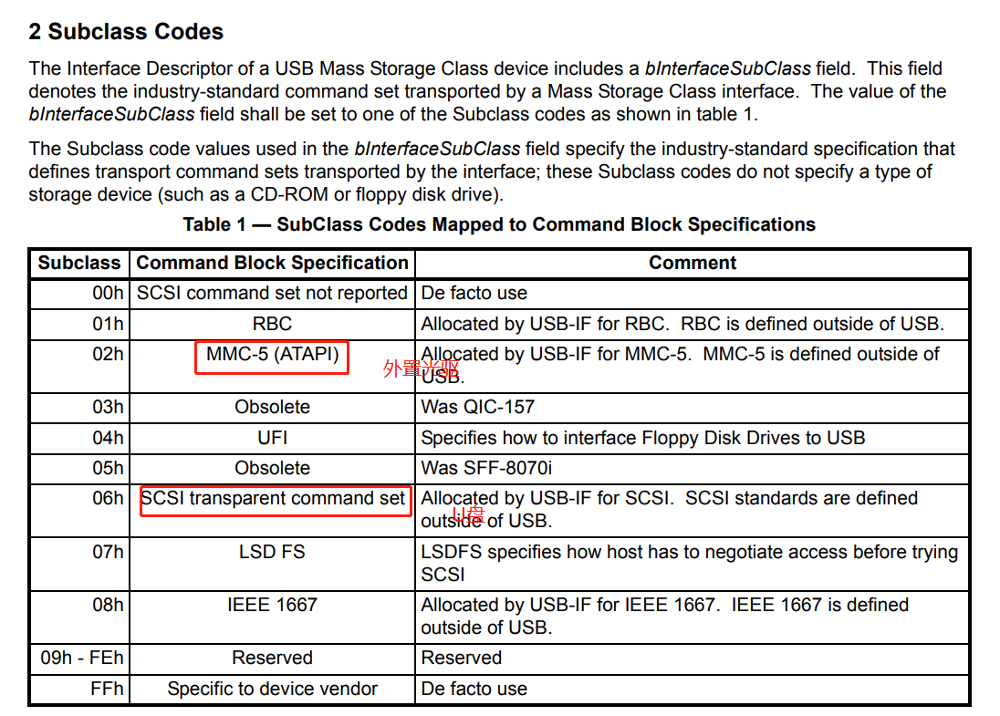

# usb设备

## usb设备热插拔监控

```c++
#include <iostream>
#include <string>

#include <stdio.h>
#include <stdlib.h>
#include <string.h>
#include <fcntl.h>
#include <unistd.h>
#include <sys/types.h>
#include <sys/socket.h>
#include <linux/netlink.h>
#include <functional>

using namespace std;

#define UEVENT_BUFFER_SIZE 4096


int main() {
    struct sockaddr_nl client;
    struct timeval tv;
    int CppLive, rcvlen, ret;
    fd_set fds;
    int buffersize = UEVENT_BUFFER_SIZE;
    CppLive = socket(AF_NETLINK, SOCK_RAW, NETLINK_KOBJECT_UEVENT);
    memset(&client, 0, sizeof(client));
    client.nl_family = AF_NETLINK;
    client.nl_pid = getpid();
    client.nl_groups = NETLINK_KOBJECT_UEVENT; // receive broadcast message
    setsockopt(CppLive, SOL_SOCKET, SO_RCVBUF, &buffersize, sizeof(buffersize));
    bind(CppLive, (struct sockaddr*)&client, sizeof(client));
    while (1) {
        char buf[UEVENT_BUFFER_SIZE] = { 0 };
        FD_ZERO(&fds);
        FD_SET(CppLive, &fds);
        tv.tv_sec = 0;
        tv.tv_usec = 100 * 1000;
        ret = select(CppLive + 1, &fds, NULL, NULL, &tv);
        if (ret < 0)
            continue;
        if (!(ret > 0 && FD_ISSET(CppLive, &fds)))
            continue;
        // receive data 
        rcvlen = recv(CppLive, &buf, sizeof(buf), 0);
        if (rcvlen > 0) {
            for (int i = 0; i < rcvlen; i++)
                if (*(buf + i) == '\0')
                    buf[i] = ' ';
            if (strstr(buf, "SUBSYSTEM=usb") == NULL)
                continue;
            //            printf("%d,%s\n", rcvlen, buf);
                        //You can do something here to make the program more perfect!!!
            std::cout << "-------------------------"  <<  std::endl;
            std::cout << buf <<  std::endl;
            std::cout << "-------------------------" << std::endl;

        }
    }
    close(CppLive);

    return 0;
}
```

日志：上面是U盘，下面是usb外置光驱

```txt
-------------------------
add@/devices/pci0000:00/0000:00:11.0/0000:02:03.0/usb1/1-1 ACTION=add DEVPATH=/devices/pci0000:00/0000:00:11.0/0000:02:03.0/usb1/1-1 SUBSYSTEM=usb MAJOR=189 MINOR=4 DEVNAME=bus/usb/001/005 DEVTYPE=usb_device PRODUCT=58f/6387/102 TYPE=0/0/0 BUSNUM=001 DEVNUM=005 SEQNUM=11872 
-------------------------
-------------------------
add@/devices/pci0000:00/0000:00:11.0/0000:02:03.0/usb1/1-1/1-1:1.0 ACTION=add DEVPATH=/devices/pci0000:00/0000:00:11.0/0000:02:03.0/usb1/1-1/1-1:1.0 SUBSYSTEM=usb DEVTYPE=usb_interface PRODUCT=58f/6387/102 TYPE=0/0/0 INTERFACE=8/6/80 MODALIAS=usb:v058Fp6387d0102dc00dsc00dp00ic08isc06ip50in00 SEQNUM=11873 
-------------------------
-------------------------
bind@/devices/pci0000:00/0000:00:11.0/0000:02:03.0/usb1/1-1/1-1:1.0 ACTION=bind DEVPATH=/devices/pci0000:00/0000:00:11.0/0000:02:03.0/usb1/1-1/1-1:1.0 SUBSYSTEM=usb DEVTYPE=usb_interface DRIVER=usb-storage PRODUCT=58f/6387/102 TYPE=0/0/0 INTERFACE=8/6/80 MODALIAS=usb:v058Fp6387d0102dc00dsc00dp00ic08isc06ip50in00 SEQNUM=11876 
-------------------------
-------------------------
bind@/devices/pci0000:00/0000:00:11.0/0000:02:03.0/usb1/1-1 ACTION=bind DEVPATH=/devices/pci0000:00/0000:00:11.0/0000:02:03.0/usb1/1-1 SUBSYSTEM=usb MAJOR=189 MINOR=4 DEVNAME=bus/usb/001/005 DEVTYPE=usb_device DRIVER=usb PRODUCT=58f/6387/102 TYPE=0/0/0 BUSNUM=001 DEVNUM=005 SEQNUM=11877 
-------------------------
-------------------------
libudev ����(   (   ;  w��'��
                                      ACTION=add DEVPATH=/devices/pci0000:00/0000:00:11.0/0000:02:03.0/usb1/1-1 SUBSYSTEM=usb DEVNAME=/dev/bus/usb/001/005 DEVTYPE=usb_device PRODUCT=58f/6387/102 TYPE=0/0/0 BUSNUM=001 DEVNUM=005 SEQNUM=11872 MAJOR=189 MINOR=4 USEC_INITIALIZED=7697898698 ID_VENDOR=Teclast ID_VENDOR_ENC=Teclast ID_VENDOR_ID=058f ID_MODEL=CoolFlash ID_MODEL_ENC=CoolFlash ID_MODEL_ID=6387 ID_REVISION=0102 ID_SERIAL=Teclast_CoolFlash_B55B7B7A ID_SERIAL_SHORT=B55B7B7A ID_BUS=usb ID_USB_INTERFACES=:080650: ID_VENDOR_FROM_DATABASE=Alcor Micro Corp. ID_MODEL_FROM_DATABASE=Flash Drive DRIVER=usb 
-------------------------
-------------------------
libudev ����(   (   k  w���Ge        ACTION=add DEVPATH=/devices/pci0000:00/0000:00:11.0/0000:02:03.0/usb1/1-1/1-1:1.0 SUBSYSTEM=usb DEVTYPE=usb_interface PRODUCT=58f/6387/102 TYPE=0/0/0 INTERFACE=8/6/80 MODALIAS=usb:v058Fp6387d0102dc00dsc00dp00ic08isc06ip50in00 SEQNUM=11873 USEC_INITIALIZED=7697901121 ID_VENDOR_FROM_DATABASE=Alcor Micro Corp. ID_MODEL_FROM_DATABASE=Flash Drive DRIVER=usb-storage 
-------------------------
-------------------------
libudev ����(   (   l  w���Ge        ACTION=bind DEVPATH=/devices/pci0000:00/0000:00:11.0/0000:02:03.0/usb1/1-1/1-1:1.0 SUBSYSTEM=usb DEVTYPE=usb_interface DRIVER=usb-storage PRODUCT=58f/6387/102 TYPE=0/0/0 INTERFACE=8/6/80 MODALIAS=usb:v058Fp6387d0102dc00dsc00dp00ic08isc06ip50in00 SEQNUM=11876 USEC_INITIALIZED=7697901121 ID_VENDOR_FROM_DATABASE=Alcor Micro Corp. ID_MODEL_FROM_DATABASE=Flash Drive 
-------------------------
-------------------------
libudev ����(   (   <  w��'��
                                      ACTION=bind DEVPATH=/devices/pci0000:00/0000:00:11.0/0000:02:03.0/usb1/1-1 SUBSYSTEM=usb DEVNAME=/dev/bus/usb/001/005 DEVTYPE=usb_device DRIVER=usb PRODUCT=58f/6387/102 TYPE=0/0/0 BUSNUM=001 DEVNUM=005 SEQNUM=11877 USEC_INITIALIZED=7697898698 MAJOR=189 MINOR=4 ID_VENDOR=Teclast ID_VENDOR_ENC=Teclast ID_VENDOR_ID=058f ID_MODEL=CoolFlash ID_MODEL_ENC=CoolFlash ID_MODEL_ID=6387 ID_REVISION=0102 ID_SERIAL=Teclast_CoolFlash_B55B7B7A ID_SERIAL_SHORT=B55B7B7A ID_BUS=usb ID_USB_INTERFACES=:080650: ID_VENDOR_FROM_DATABASE=Alcor Micro Corp. ID_MODEL_FROM_DATABASE=Flash Drive 
-------------------------


-------------------------
unbind@/devices/pci0000:00/0000:00:11.0/0000:02:03.0/usb1/1-1/1-1:1.0 ACTION=unbind DEVPATH=/devices/pci0000:00/0000:00:11.0/0000:02:03.0/usb1/1-1/1-1:1.0 SUBSYSTEM=usb DEVTYPE=usb_interface PRODUCT=58f/6387/102 TYPE=0/0/0 INTERFACE=8/6/80 SEQNUM=11902 
-------------------------
-------------------------
remove@/devices/pci0000:00/0000:00:11.0/0000:02:03.0/usb1/1-1/1-1:1.0 ACTION=remove DEVPATH=/devices/pci0000:00/0000:00:11.0/0000:02:03.0/usb1/1-1/1-1:1.0 SUBSYSTEM=usb DEVTYPE=usb_interface PRODUCT=58f/6387/102 TYPE=0/0/0 INTERFACE=8/6/80 MODALIAS=usb:v058Fp6387d0102dc00dsc00dp00ic08isc06ip50in00 SEQNUM=11903 
-------------------------
-------------------------
unbind@/devices/pci0000:00/0000:00:11.0/0000:02:03.0/usb1/1-1 ACTION=unbind DEVPATH=/devices/pci0000:00/0000:00:11.0/0000:02:03.0/usb1/1-1 SUBSYSTEM=usb MAJOR=189 MINOR=4 DEVNAME=bus/usb/001/005 DEVTYPE=usb_device PRODUCT=58f/6387/102 TYPE=0/0/0 BUSNUM=001 DEVNUM=005 SEQNUM=11904 
-------------------------
-------------------------
remove@/devices/pci0000:00/0000:00:11.0/0000:02:03.0/usb1/1-1 ACTION=remove DEVPATH=/devices/pci0000:00/0000:00:11.0/0000:02:03.0/usb1/1-1 SUBSYSTEM=usb MAJOR=189 MINOR=4 DEVNAME=bus/usb/001/005 DEVTYPE=usb_device PRODUCT=58f/6387/102 TYPE=0/0/0 BUSNUM=001 DEVNUM=005 SEQNUM=11905 
-------------------------
-------------------------
libudev ����(   (   �   w���Ge        ACTION=unbind DEVPATH=/devices/pci0000:00/0000:00:11.0/0000:02:03.0/usb1/1-1/1-1:1.0 SUBSYSTEM=usb DEVTYPE=usb_interface PRODUCT=58f/6387/102 TYPE=0/0/0 INTERFACE=8/6/80 SEQNUM=11902 USEC_INITIALIZED=7697901121 
-------------------------
-------------------------
libudev ����(   (     w���Ge        ACTION=remove DEVPATH=/devices/pci0000:00/0000:00:11.0/0000:02:03.0/usb1/1-1/1-1:1.0 SUBSYSTEM=usb DEVTYPE=usb_interface PRODUCT=58f/6387/102 TYPE=0/0/0 INTERFACE=8/6/80 MODALIAS=usb:v058Fp6387d0102dc00dsc00dp00ic08isc06ip50in00 SEQNUM=11903 USEC_INITIALIZED=7703213014 
-------------------------
-------------------------
libudev ����(   (   �   w��'��
                                      ACTION=unbind DEVPATH=/devices/pci0000:00/0000:00:11.0/0000:02:03.0/usb1/1-1 SUBSYSTEM=usb DEVNAME=/dev/bus/usb/001/005 DEVTYPE=usb_device PRODUCT=58f/6387/102 TYPE=0/0/0 BUSNUM=001 DEVNUM=005 SEQNUM=11904 USEC_INITIALIZED=7697898698 MAJOR=189 MINOR=4 
-------------------------
-------------------------
libudev ����(   (   �   w��'��
                                      ACTION=remove DEVPATH=/devices/pci0000:00/0000:00:11.0/0000:02:03.0/usb1/1-1 SUBSYSTEM=usb DEVNAME=/dev/bus/usb/001/005 DEVTYPE=usb_device PRODUCT=58f/6387/102 TYPE=0/0/0 BUSNUM=001 DEVNUM=005 SEQNUM=11905 USEC_INITIALIZED=7703213326 MAJOR=189 MINOR=4 
-------------------------


-------------------------
add@/devices/pci0000:00/0000:00:11.0/0000:02:03.0/usb1/1-1 ACTION=add DEVPATH=/devices/pci0000:00/0000:00:11.0/0000:02:03.0/usb1/1-1 SUBSYSTEM=usb MAJOR=189 MINOR=5 DEVNAME=bus/usb/001/006 DEVTYPE=usb_device PRODUCT=1c6b/a223/0 TYPE=0/0/0 BUSNUM=001 DEVNUM=006 SEQNUM=11906 
-------------------------
-------------------------
add@/devices/pci0000:00/0000:00:11.0/0000:02:03.0/usb1/1-1/1-1:1.0 ACTION=add DEVPATH=/devices/pci0000:00/0000:00:11.0/0000:02:03.0/usb1/1-1/1-1:1.0 SUBSYSTEM=usb DEVTYPE=usb_interface PRODUCT=1c6b/a223/0 TYPE=0/0/0 INTERFACE=8/2/80 MODALIAS=usb:v1C6BpA223d0000dc00dsc00dp00ic08isc02ip50in00 SEQNUM=11907 
-------------------------
-------------------------
bind@/devices/pci0000:00/0000:00:11.0/0000:02:03.0/usb1/1-1/1-1:1.0 ACTION=bind DEVPATH=/devices/pci0000:00/0000:00:11.0/0000:02:03.0/usb1/1-1/1-1:1.0 SUBSYSTEM=usb DEVTYPE=usb_interface DRIVER=usb-storage PRODUCT=1c6b/a223/0 TYPE=0/0/0 INTERFACE=8/2/80 MODALIAS=usb:v1C6BpA223d0000dc00dsc00dp00ic08isc02ip50in00 SEQNUM=11910 
-------------------------
-------------------------
bind@/devices/pci0000:00/0000:00:11.0/0000:02:03.0/usb1/1-1 ACTION=bind DEVPATH=/devices/pci0000:00/0000:00:11.0/0000:02:03.0/usb1/1-1 SUBSYSTEM=usb MAJOR=189 MINOR=5 DEVNAME=bus/usb/001/006 DEVTYPE=usb_device DRIVER=usb PRODUCT=1c6b/a223/0 TYPE=0/0/0 BUSNUM=001 DEVNUM=006 SEQNUM=11911 
-------------------------
-------------------------
libudev ����(   (   �  w��'��
                                      ACTION=add DEVPATH=/devices/pci0000:00/0000:00:11.0/0000:02:03.0/usb1/1-1 SUBSYSTEM=usb DEVNAME=/dev/bus/usb/001/006 DEVTYPE=usb_device PRODUCT=1c6b/a223/0 TYPE=0/0/0 BUSNUM=001 DEVNUM=006 SEQNUM=11906 MAJOR=189 MINOR=5 USEC_INITIALIZED=7716118428 ID_VENDOR=USB2.0_External ID_VENDOR_ENC=USB2.0\x20External ID_VENDOR_ID=1c6b ID_MODEL=Mass_Storage_Device ID_MODEL_ENC=Mass\x20Storage\x20Device ID_MODEL_ID=a223 ID_REVISION=0000 ID_SERIAL=USB2.0_External_Mass_Storage_Device_09_426102504806 ID_SERIAL_SHORT=09_426102504806 ID_BUS=usb ID_USB_INTERFACES=:080250: ID_VENDOR_FROM_DATABASE=Philips & Lite-ON Digital Solutions Corporation DRIVER=usb 
-------------------------
-------------------------
libudev ����(   (   e  w���Ge        ACTION=add DEVPATH=/devices/pci0000:00/0000:00:11.0/0000:02:03.0/usb1/1-1/1-1:1.0 SUBSYSTEM=usb DEVTYPE=usb_interface PRODUCT=1c6b/a223/0 TYPE=0/0/0 INTERFACE=8/2/80 MODALIAS=usb:v1C6BpA223d0000dc00dsc00dp00ic08isc02ip50in00 SEQNUM=11907 USEC_INITIALIZED=7716121913 ID_VENDOR_FROM_DATABASE=Philips & Lite-ON Digital Solutions Corporation DRIVER=usb-storage 
-------------------------
-------------------------
libudev ����(   (   f  w���Ge        ACTION=bind DEVPATH=/devices/pci0000:00/0000:00:11.0/0000:02:03.0/usb1/1-1/1-1:1.0 SUBSYSTEM=usb DEVTYPE=usb_interface DRIVER=usb-storage PRODUCT=1c6b/a223/0 TYPE=0/0/0 INTERFACE=8/2/80 MODALIAS=usb:v1C6BpA223d0000dc00dsc00dp00ic08isc02ip50in00 SEQNUM=11910 USEC_INITIALIZED=7716121913 ID_VENDOR_FROM_DATABASE=Philips & Lite-ON Digital Solutions Corporation 
-------------------------
-------------------------
libudev ����(   (   �  w��'��
                                      ACTION=bind DEVPATH=/devices/pci0000:00/0000:00:11.0/0000:02:03.0/usb1/1-1 SUBSYSTEM=usb DEVNAME=/dev/bus/usb/001/006 DEVTYPE=usb_device DRIVER=usb PRODUCT=1c6b/a223/0 TYPE=0/0/0 BUSNUM=001 DEVNUM=006 SEQNUM=11911 USEC_INITIALIZED=7716118428 MAJOR=189 MINOR=5 ID_VENDOR=USB2.0_External ID_VENDOR_ENC=USB2.0\x20External ID_VENDOR_ID=1c6b ID_MODEL=Mass_Storage_Device ID_MODEL_ENC=Mass\x20Storage\x20Device ID_MODEL_ID=a223 ID_REVISION=0000 ID_SERIAL=USB2.0_External_Mass_Storage_Device_09_426102504806 ID_SERIAL_SHORT=09_426102504806 ID_BUS=usb ID_USB_INTERFACES=:080250: ID_VENDOR_FROM_DATABASE=Philips & Lite-ON Digital Solutions Corporation 
-------------------------


-------------------------
unbind@/devices/pci0000:00/0000:00:11.0/0000:02:03.0/usb1/1-1/1-1:1.0 ACTION=unbind DEVPATH=/devices/pci0000:00/0000:00:11.0/0000:02:03.0/usb1/1-1/1-1:1.0 SUBSYSTEM=usb DEVTYPE=usb_interface PRODUCT=1c6b/a223/0 TYPE=0/0/0 INTERFACE=8/2/80 SEQNUM=11932 
-------------------------
-------------------------
remove@/devices/pci0000:00/0000:00:11.0/0000:02:03.0/usb1/1-1/1-1:1.0 ACTION=remove DEVPATH=/devices/pci0000:00/0000:00:11.0/0000:02:03.0/usb1/1-1/1-1:1.0 SUBSYSTEM=usb DEVTYPE=usb_interface PRODUCT=1c6b/a223/0 TYPE=0/0/0 INTERFACE=8/2/80 MODALIAS=usb:v1C6BpA223d0000dc00dsc00dp00ic08isc02ip50in00 SEQNUM=11933 
-------------------------
-------------------------
unbind@/devices/pci0000:00/0000:00:11.0/0000:02:03.0/usb1/1-1 ACTION=unbind DEVPATH=/devices/pci0000:00/0000:00:11.0/0000:02:03.0/usb1/1-1 SUBSYSTEM=usb MAJOR=189 MINOR=5 DEVNAME=bus/usb/001/006 DEVTYPE=usb_device PRODUCT=1c6b/a223/0 TYPE=0/0/0 BUSNUM=001 DEVNUM=006 SEQNUM=11934 
-------------------------
-------------------------
remove@/devices/pci0000:00/0000:00:11.0/0000:02:03.0/usb1/1-1 ACTION=remove DEVPATH=/devices/pci0000:00/0000:00:11.0/0000:02:03.0/usb1/1-1 SUBSYSTEM=usb MAJOR=189 MINOR=5 DEVNAME=bus/usb/001/006 DEVTYPE=usb_device PRODUCT=1c6b/a223/0 TYPE=0/0/0 BUSNUM=001 DEVNUM=006 SEQNUM=11935 
-------------------------
-------------------------
libudev ����(   (   �   w���Ge        ACTION=unbind DEVPATH=/devices/pci0000:00/0000:00:11.0/0000:02:03.0/usb1/1-1/1-1:1.0 SUBSYSTEM=usb DEVTYPE=usb_interface PRODUCT=1c6b/a223/0 TYPE=0/0/0 INTERFACE=8/2/80 SEQNUM=11932 USEC_INITIALIZED=7716121913 
-------------------------
-------------------------
  w���Ge        ACTION=remove DEVPATH=/devices/pci0000:00/0000:00:11.0/0000:02:03.0/usb1/1-1/1-1:1.0 SUBSYSTEM=usb DEVTYPE=usb_interface PRODUCT=1c6b/a223/0 TYPE=0/0/0 INTERFACE=8/2/80 MODALIAS=usb:v1C6BpA223d0000dc00dsc00dp00ic08isc02ip50in00 SEQNUM=11933 USEC_INITIALIZED=7719932452 
-------------------------
-------------------------
libudev ����(   (   �   w��'��
                                      ACTION=unbind DEVPATH=/devices/pci0000:00/0000:00:11.0/0000:02:03.0/usb1/1-1 SUBSYSTEM=usb DEVNAME=/dev/bus/usb/001/006 DEVTYPE=usb_device PRODUCT=1c6b/a223/0 TYPE=0/0/0 BUSNUM=001 DEVNUM=006 SEQNUM=11934 USEC_INITIALIZED=7716118428 MAJOR=189 MINOR=5 
-------------------------
-------------------------
libudev ����(   (   �   w��'��
                                      ACTION=remove DEVPATH=/devices/pci0000:00/0000:00:11.0/0000:02:03.0/usb1/1-1 SUBSYSTEM=usb DEVNAME=/dev/bus/usb/001/006 DEVTYPE=usb_device PRODUCT=1c6b/a223/0 TYPE=0/0/0 BUSNUM=001 DEVNUM=006 SEQNUM=11935 USEC_INITIALIZED=7719932622 MAJOR=189 MINOR=5 
-------------------------
```

## 大容量存储设备标准

https://usb.org/sites/default/files/Mass_Storage_Specification_Overview_v1.4_2-19-2010.pdf



