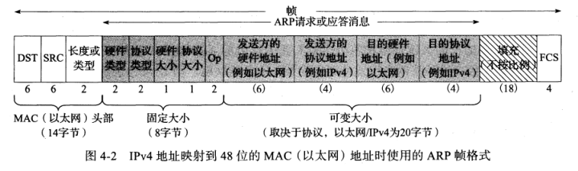
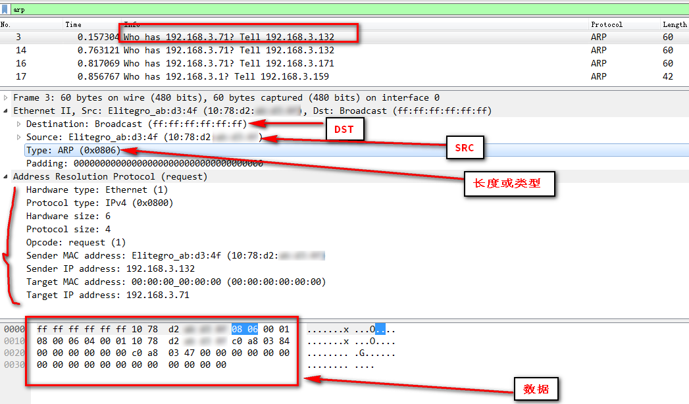

# TCP/IP

## 基础

1. tcp/ip特性

* 逻辑编址
* 路由选择
* 名称解析
* 错误控制和流量控制
* 应用支持

2. 以太网软件使用的地址并不是逻辑IP地址，但这个地址在网际层上与IP地址有映射关系。

   getmac nbtstat 


3. 全0的主机ID表示网络本身，全1的主机ID表示广播，127开头的地址是环回地址，私有地址

   

### ARP

资料：

[arp协议揭秘](https://www.ibm.com/developerworks/cn/linux/l-arp/index.html)

arp把IP地址映射为物理地址。消息需要物理地址才能到达目的地。网段上每台主机在内存中都保存着一个被称为ARP表或者ARP缓存的表格，其中包含着网段上其他主机的IP地址与物理地址的对应关系。ARP缓存是动态变化的。

```bash
C:\Users\Administrator>arp -a 192.168.3.225

接口: 192.168.3.159 --- 0xc
  Internet 地址         物理地址              类型
  192.168.3.225         f4-93-9f-f8-d9-55     动态

C:\Users\Administrator>arp -a

接口: 192.168.3.159 --- 0xc
  Internet 地址         物理地址              类型
  192.168.3.1           50-da-00-b2-a8-74     动态
  192.168.3.36          2c-fd-a1-c6-b5-0c     动态
  192.168.3.40          68-f7-28-5d-52-8f     动态
  192.168.3.70          00-25-b3-f1-dd-d7     动态
  192.168.3.77          08-00-27-38-2f-1f     动态
  192.168.3.80          44-8a-5b-20-74-da     动态
  192.168.3.83          08-00-27-1f-c9-23     动态
  192.168.3.95          08-00-27-38-25-b7     动态
```

**帧格式和抓包记录**

**帧格式**



**抓包记录**



### 传输层

多路复用/多路分解

多路复用：是把多个来源的数据导向一个输出

多路分解：把从一个来源接收的数据发送到多个输出

#### 防火墙

防火墙不仅能阻止外部用户访问网络内部的服务，也能阻止内部用户访问网络外部的服务。

### 应用层协议

文件服务系统，详见 [./tcp_ip/file_service_system.md](./tcp_ip/file_service_system.md)

名称解析服务、远程访问、web服务等

## 路由选择

早期的路由器实际上就是具有两块或多块网络适配器的计算机。IP地址是属于适配器的，而不是计算机的。适配器可以具有完全不同的IP子网，对应于完全不同的物理网络。

目前网络上的大多数路由器不是多宿主计算机，因为让专门的设备来负责路由具有更高的性价比。

内部路由器：

RIP: 距离矢量协议，根据跳数来判断到达目的的最佳路由。

OSPF: 开放最短路径优先，是比较新的内部路由协议，正在取代RIP。是个链路状态协议。

外部路由器：

BGP: 边界网关协议

### 命令

getmac（获取本机ip）

nbtstat -a ip（获取对应ip的mac）

arp

nslookup

dig


### 名词

ARP:  Address Resolution Protocol 地址解析协议

RARP:  Reserve ARP 逆向地址解析协议

​						ARP

​	IP				---->		MAC

​	Address	<----		Address

​						RARP

**DNS**: Domain Name System 域名系统。就是根据域名查出IP地址。

​	主机名.次级域名.顶级域名.根域名

​	即：host.sld.tld.root

​	nslookup(windows) dig(windows需要安装)

**MAC 地址**: Media Access Control *Address* 介质访问控制地址

**CIDR**: Classless Inter-Domain Routing 无类别域间路由

**NAT**: Network Address Translation 网络地址转换，又称网络掩蔽、IP掩蔽，在计算机网络中是一种在IP数据包通过路由器或防火墙时重写来源IP地址或目的IP地址的技术。这种技术被普遍使用在有多台主机但只通过一个公有IP地址访问因特网的私有网络中。

**Ethernet**: [以太网]([https://zh.wikipedia.org/wiki/%E4%BB%A5%E5%A4%AA%E7%BD%91](https://zh.wikipedia.org/wiki/以太网))，是一种计算机局域网技术。IEEE组织的IEEE 802.3标准制定了以太网的技术标准，它规定了包括物理层的连线、电子信号和介质访问层协议的内容。

**ICMP**: Internet control message protocol Internet控制消息协议，发送到远程计算机的数据通常会经过一个或多个路由器，这些路由器在把数据传输到最终目的地的过程中可能发生多种问题。路由器利用Internet控制消息协议消息吧问题通知给源IP。

**IANA**: Internet Assigned Numbers Authority 互联网号码分配局