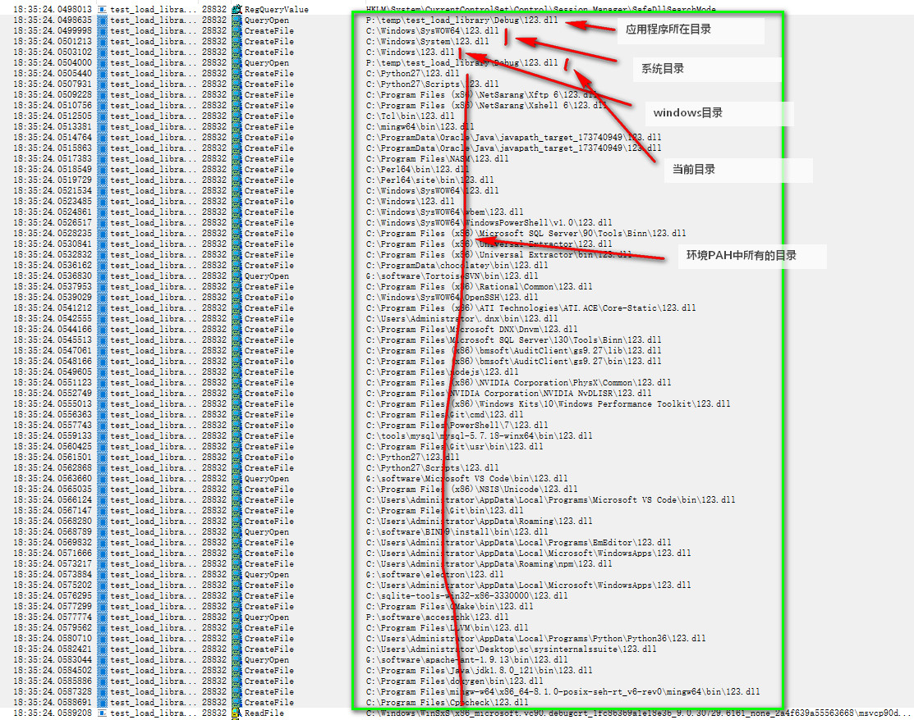

## windows
规则较多，详见：
- (Dynamic-Link Library Search Order)[https://docs.microsoft.com/zh-cn/windows/win32/dlls/dynamic-link-library-search-order?redirectedfrom=MSDN]
- [Windows下DLL查找顺序](https://www.cnblogs.com/tocy/p/windows_dll_searth_path.html)

### dll查找路径基础

应用程序可以通过以下方式控制一个DLL的加载路径：使用全路径加载、使用DLL重定向、使用manifest文件。如果上述三种方式均未指定，系统查找DLL的顺序将按照本部分描述的顺序进行。
a. 对于已经加载到内存中的同名DLL，系统使用已经加载的DLL，并且忽略待加载DLL的路径。
b. 如果该DLL存在于某个Windows版本的已知DLL列表（unkown DLL）中。

### 查找顺序

#### 安全DLL查找模式（safe DLL search mode）

a. 应用程序所在目录；

b. 系统目录。GetSystemDirectory返回的目录，通常是系统盘\Windows\System32；

c. 16位系统目录。该项只是为了向前兼容的处理，可以不考虑；

d. Windows目录。GetWindowsDirectory返回的目录，通常是系统盘\Windows；

e. 当前目录。GetCurrentDirectory返回的目录；

f. 环境变量PATH中所有目录。

#### 禁用安全DLL查找模式

a. 应用程序所在目录；

b. 当前目录。GetCurrentDirectory返回的目录；

c. 系统目录。GetSystemDirectory返回的目录，通常是系统盘\Windows\System32；

d. 16位系统目录。该项只是为了向前兼容的处理，可以不考虑；

e. Windows目录。GetWindowsDirectory返回的目录，通常是系统盘\Windows；

f. 环境变量PATH中所有目录。

#### 修改系统DLL查找顺序
a.  使用LOAD_WITH_ALTERED_SEARCH_PATH标志调用LoadLibraryEx函数；
b. 调用SetDllDirectory函数
    - 应用程序所在目录；
    - 函数SetDllDirectory参数lpPathName给定的目录；
    - 系统目录。GetSystemDirectory返回的目录，通常是系统盘\Windows\System32；
    - ...

### 简单验证
```cpp
#include <windows.h>
#include <iostream>

int main(int argc, char ** argv)
{
    using std::cout;
    using std::endl;

    // 随便设置一个不存在的dll名
    HMODULE hMod = LoadLibrary("123.dll");

    if (NULL != hMod)
        FreeLibrary(hMod);

    cout << "LoadLibrary Test" << endl;

    return 0;
}
```
procmon检测如下：
  

### 总结
1. 一般情况下，可以认为是安全DLL查找模式的顺序，如果遇到加载问题，可以使用Depends、DependenciesGui等工具查看依赖，使用procmon查看动态库加载过程来排查问题。

2. 程序加载插件（第三方dll）时，如果插件：有依赖库、在单独的目录、插件隐式加载依赖库，这时候可以把插件所在的路径添加到环境变量PATH中。

   ```c++
   // set library search path
   
   std::string fullpath;// dll full path
   
   std::string dllDirPath;// get plugin dir
   
   char strPath[8192] = { 0 };
   if (FALSE == GetEnvironmentVariableA("PATH", strPath, 8192)) {
     spdlog::error("GetEnvironmentVariableA fail: {}", GetLastError());
   }
   strcat(strPath, ";");
   strcat(strPath, dllDirPath.c_str());
   
   if (FALSE == SetEnvironmentVariableA("PATH", strPath)) {
     spdlog::error("SetEnvironmentVariableA fail: {}", GetLastError());
   }
   
   memset(strPath, 0, 8192);
   if (FALSE == GetEnvironmentVariableA("PATH", strPath, 8192)) {
     spdlog::error("GetEnvironmentVariableA fail: {}", GetLastError());
   }
   printf("after set path=%s\n", strPath);
   
   LibraryHandle handle = LoadLibraryA(fullpath.c_str());
   ```

   

